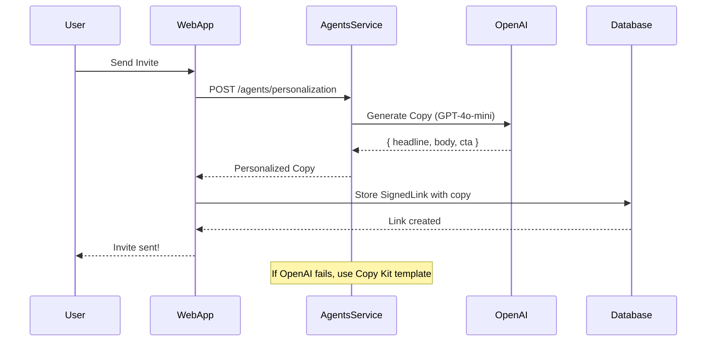
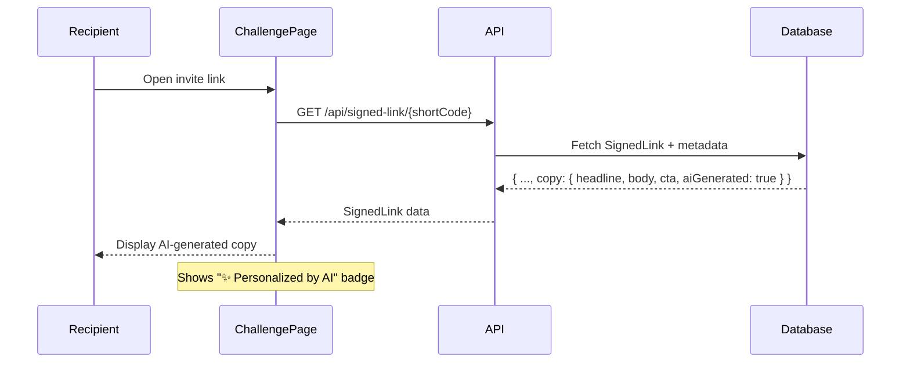

# AI Agents Setup Guide

## Overview

The platform now supports **real AI agents** powered by OpenAI GPT-4o-mini for dynamic, personalized content generation. This replaces static templates with intelligent, context-aware copy that adapts to each user.

## ✅ What's Integrated

### 1. **AI-Powered Personalization Agent**
- **Where**: Real user invite flow (`/api/invites/create`)
- **What**: Generates unique, personalized invite copy for each invitation
- **Fallback**: Automatically uses Copy Kit templates if AI unavailable
- **Cost**: ~$0.002 per invite with GPT-4o-mini

### 2. **Challenge Page Integration**
- Displays AI-generated copy (headline, body, CTA) when users receive invites
- Shows "✨ Personalized by AI" badge when AI-generated
- Seamlessly falls back to default copy if not available

### 3. **Rate Limiting & Safety**
- 10 AI calls per minute per user (prevents abuse)
- Automatic fallback to templates on errors
- Character limits enforced (60 char headlines, 160 char body, 20 char CTA)

---

## 🚀 Setup Instructions

### Step 1: Add OpenAI API Key

1. Get your API key from [platform.openai.com/api-keys](https://platform.openai.com/api-keys)
2. Add to your environment variables:

**Option A: Set in shell (temporary, for testing):**
```bash
# PowerShell (Windows)
$env:OPENAI_API_KEY="sk-proj-YOUR_KEY_HERE"

# Bash/Zsh (Mac/Linux)
export OPENAI_API_KEY="sk-proj-YOUR_KEY_HERE"
```

**Option B: Add to `apps/web/.env.local` (persistent):**
```bash
OPENAI_API_KEY="sk-proj-YOUR_KEY_HERE"
```

**Note:** The agents service reads from environment variables, so set it in your shell before running `pnpm --filter @app/agents dev`.

### Step 2: Start Services

**Terminal 1: Agents Service**
```bash
# PowerShell (Windows)
$env:OPENAI_API_KEY="sk-proj-YOUR_KEY_HERE"
pnpm --filter @app/agents dev

# Bash/Zsh (Mac/Linux)
export OPENAI_API_KEY="sk-proj-YOUR_KEY_HERE"
pnpm --filter @app/agents dev
```

**Terminal 2: Web App**
```bash
pnpm --filter web dev
```

The agents service will show:
- `🤖 AI-Powered: OpenAI ✅` if API key is valid
- `🤖 AI-Powered: OpenAI ❌ (using templates)` if API key is missing/invalid

### Step 3: Verify AI is Working

Navigate to: `http://localhost:4000/ai/test`

Expected response:
```json
{
  "status": "success",
  "message": "OpenAI API is working!",
  "testResponse": { "message": "Hello from OpenAI!" },
  "info": {
    "model": "gpt-4o-mini",
    "rateLimit": "10 calls/minute per user",
    "cost": "~$0.002 per invite"
  }
}
```

If you see `"status": "unavailable"`, check that `OPENAI_API_KEY` is set correctly.

---

## 🧪 Testing AI-Generated Copy

### Option 1: Via API

**Test personalization endpoint:**
```bash
curl -X POST http://localhost:4000/ai/test-personalization \
  -H "Content-Type: application/json" \
  -d '{
    "persona": "student",
    "loop": "buddy-challenge",
    "subject": "Algebra",
    "score": 9
  }'
```

**Expected response:**
```json
{
  "status": "success",
  "aiGenerated": true,
  "copy": {
    "headline": "Think you can beat my Algebra score? 🎯",
    "body": "I just crushed this Algebra challenge with 9/10! Your turn to try and top it 💪",
    "cta": "Accept Challenge"
  },
  "tone": "friendly",
  "urgency": "medium",
  "latency": "850ms"
}
```

### Option 2: Via Real User Flow

1. Sign in to web app: `http://localhost:3000/auth/signin`
2. Complete a challenge
3. Send an invite to a friend
4. Check the database for the generated copy:

```sql
SELECT 
  "shortCode",
  metadata->'copy'->>'headline' as headline,
  metadata->'copy'->>'body' as body,
  metadata->'copy'->>'aiGenerated' as ai_generated
FROM "SignedLink"
ORDER BY "createdAt" DESC
LIMIT 5;
```

5. Open the challenge link and see the AI-generated copy displayed

---

## 📊 How It Works

### Invite Creation Flow (Real Users)



### Challenge Page Display



---

## 💡 AI vs Templates

| Feature | AI-Powered (GPT-4o-mini) | Copy Kit Templates |
|---------|--------------------------|-------------------|
| **Variety** | Every invite is unique | ~16 templates (4 loops × 4 tones) |
| **Context-Aware** | Adapts to score, subject, user history | Placeholder replacement only |
| **Tone** | Dynamic (learns from context) | Fixed per persona/loop |
| **Cost** | ~$0.002 per invite | Free |
| **Latency** | ~500-1000ms | <10ms |
| **Fallback** | Uses templates if AI fails | N/A |

---

## 🎯 What Real Users Experience

### Before (Templates):
**Headline:** "Challenge from Alex!"
**Body:** "Alex scored 90% on Algebra. Think you can beat that?"
**CTA:** "Start Challenge"

### After (AI-Generated):
**Headline:** "Can you top my Algebra score? 🎯"
**Body:** "Just aced this Algebra challenge with 9/10! Ready to show what you've got?"
**CTA:** "Bring It On"
*✨ Personalized by AI*

---

## 📈 Monitoring AI Usage

### Check Agent Status
```bash
curl http://localhost:4000/health
```

### View Metrics
```bash
curl http://localhost:4000/metrics
```

### Agent Logs
The agents service logs every AI call:
```
[AI] Generated copy for user_123 (loop: buddy-challenge) - 750ms
[AI] Fallback to template for user_456 (rate limit exceeded)
```

---

## 🔒 Cost Management

### Estimated Costs (GPT-4o-mini)

| Users | Invites/Month | Monthly Cost |
|-------|---------------|--------------|
| 100 | 500 | $1 |
| 1,000 | 5,000 | $10 |
| 10,000 | 50,000 | $100 |
| 100,000 | 500,000 | $1,000 |

### Cost Optimization Strategies

1. **Rate Limiting** (✅ Implemented)
   - 10 AI calls/minute per user
   - Prevents abuse and runaway costs

2. **Fallback to Templates** (✅ Implemented)
   - If AI unavailable or rate-limited, use free templates
   - Zero downtime for users

3. **Caching** (Future)
   - Cache common invites (e.g., same score + subject)
   - Can reduce costs by 30-50%

4. **A/B Testing** (Future)
   - Run 50% AI / 50% templates
   - Measure K-factor lift vs. cost

---

## 🚧 Future AI Agents (Not Yet Built)

See `REAL_AI_AGENTS.md` for implementation plans:

### 2. Study Buddy Agent
- AI tutor that helps students with homework
- Suggests inviting friends when students struggle
- **Estimated Cost:** ~$0.02 per conversation (GPT-4o)

### 3. Parent Progress Agent
- Generates natural language progress reports
- Encourages parent → parent sharing
- **Estimated Cost:** ~$0.003 per report (GPT-4o-mini)

### 4. Loop Orchestrator Agent
- AI-powered loop selection based on user psychology
- Optimizes timing and loop choice for max conversion
- **Estimated Cost:** ~$0.001 per decision (GPT-4o-mini)

---

## 🐛 Troubleshooting

### "AI is unavailable"
- Check `OPENAI_API_KEY` is set in `.env.local`
- Verify API key is active at platform.openai.com
- Check agents service is running on port 4000

### "Rate limit exceeded"
- User has made >10 AI requests in 1 minute
- System automatically falls back to templates
- No action needed (intentional safety feature)

### "Invalid API key"
- API key format: `sk-proj-...` (starts with `sk-`)
- Make sure there are no extra spaces or quotes
- Try regenerating key at platform.openai.com

### AI not being used (still using templates)
- Check agents service logs for errors
- Test `/ai/test` endpoint to verify OpenAI connection
- Check network connectivity (firewall/proxy issues)

---

## ✅ Success Checklist

- [ ] `OPENAI_API_KEY` added to `.env.local`
- [ ] Agents service started (`pnpm --filter @app/agents dev`)
- [ ] `/ai/test` returns success
- [ ] Web app can reach agents service (port 4000)
- [ ] Created test invite and saw AI-generated copy in database
- [ ] Challenge page displays "✨ Personalized by AI" badge
- [ ] Monitoring logs show AI calls working

---

## 📚 Related Documentation

- **`REAL_AI_AGENTS.md`** - Full plan for all AI agents (Study Buddy, Parent Reports, etc.)
- **`PRD.md`** - Product requirements and viral loop mechanics
- **`TESTING_GUIDE.md`** - End-to-end testing flows
- **`packages/copy-kit/README.md`** - Template fallback system

---

## 🎉 You're Ready!

Your platform now uses real AI to generate personalized invites for real users. Every invitation is unique, contextual, and optimized for conversion.

**Next Steps:**
1. Monitor K-factor lift (AI vs templates)
2. Track costs in OpenAI dashboard
3. Consider implementing Study Buddy Agent for users (high impact)
4. A/B test AI-generated vs template copy

Questions? Check the troubleshooting section or review `REAL_AI_AGENTS.md` for implementation details.

