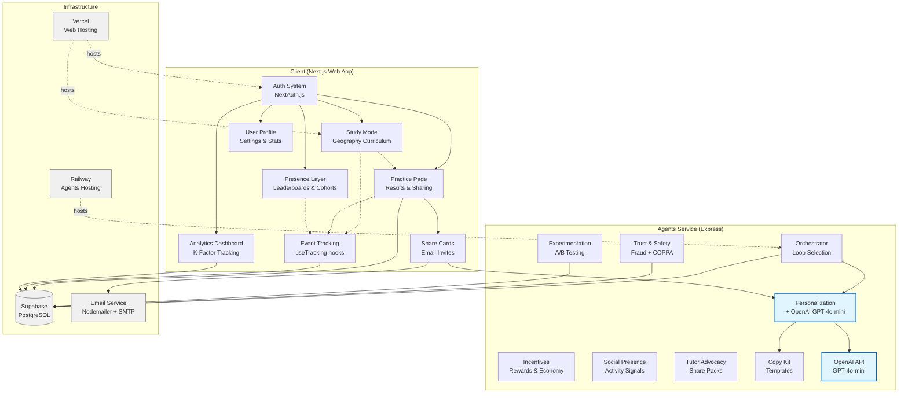
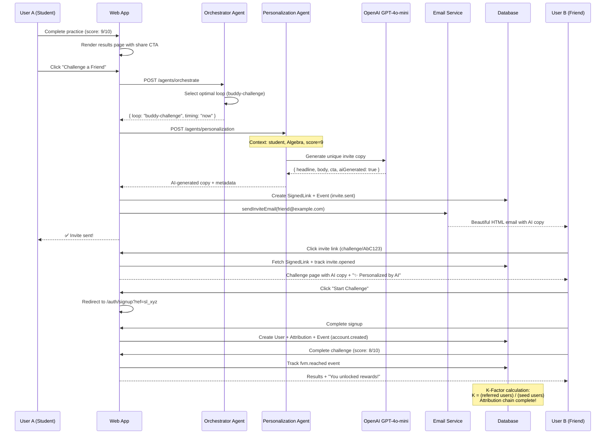
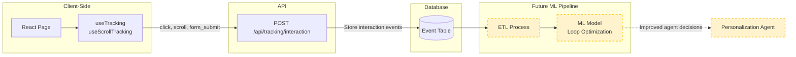
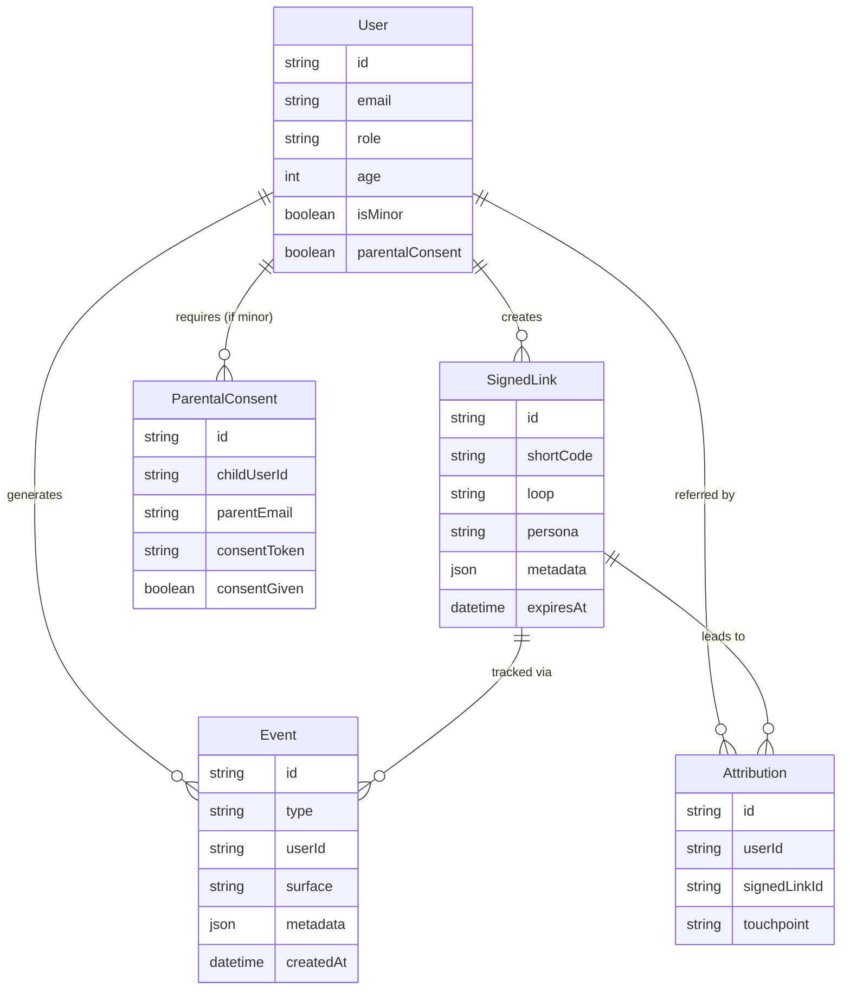
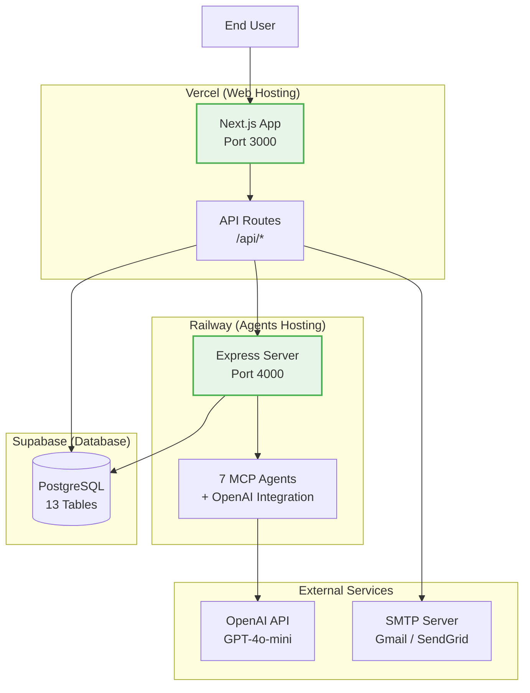

# VT K-Factor System Architecture

## High-Level System Architecture

## Viral Loop Flow (with Real AI)

## Event Tracking for AI Retraining

## Database Schema (Simplified)

## Deployment Architecture

