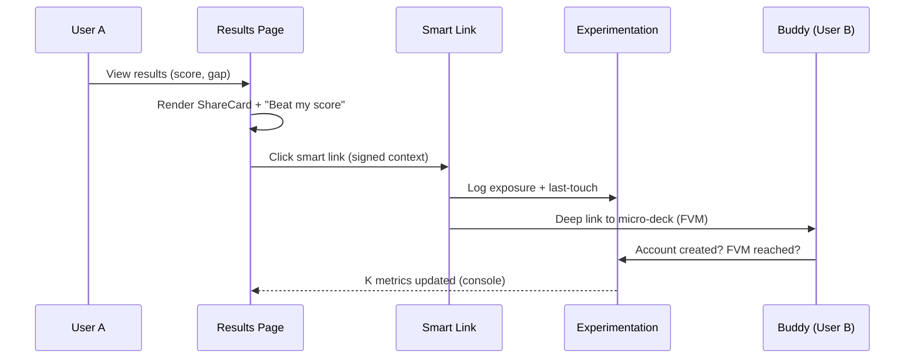

```mermaid
flowchart LR
  subgraph Client (Web)
    RP[Results Page]-->ShareCard
    RP-->CTA[Challenge/Invite CTA]
    PresenceUI-->WS[(Socket.IO - future)]
  end

  CTA-- open smart link --> SL[Smart Link Service]
  SL-- validate & attribute --> ATTR[(Attribution Memory)]
  SL-- deep link --> FV[First Value Moment]

  subgraph Agents (MCP-style)
    ORCH[Orchestrator]
    EXP[Experimentation]
  end

  Events[(Event Bus Lite)]:::bus
  SDK[(SDK pkg)] --> Events
  RP-->SDK
  FV-->SDK
  ORCH<-->EXP
  Events-->ORCH
  Events-->EXP
  EXP-->Dash[Console K Metrics]

  classDef bus fill:#eef,stroke:#99f,stroke-width:1px
```


